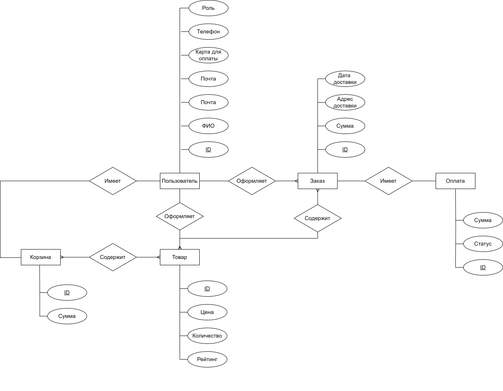

# Название проекта
Маркетплейс

# Краткое описание идеи проекта
Маркетплейс — это онлайн-платформа для продажи и покупки товаров. Продавцы размещают товары, а покупатели заказывают их, основываясь на своих предпочтениях. 

# Краткое описание предметной области
На сайте представлена полная информация о каждом товаре, и покупатель имеет возможность заказать те, которые пришлись ему по вкусу, а затем отслеживать свой товар вплоть до его прибытия в пункт выдачи.

# Краткий анализ аналогичных решений
| Название | Наличие истории заказов | Возможность отказа от товара без штрафа | Возможность покупки франшизы | 
|-------------|---|---|---|
| Ozon| + | - | - |
| Яндекс.Маркет| + | - | - |
| Wildberries| + | + | - |
| Предлагаемое решение  | + | + | + |

# Краткое обоснование целесообразности и актуальности проекта
Актуальность проекта маркетплейса может быть обоснована несколькими факторами:
- увеличение онлайн-шопинга: В последние годы онлайн-шопинг стал все более популярным, поскольку потребители предпочитают удобство покупки товаров из дома. Маркетплейс предоставляет удобную платформу для продажи и доставки товаров, удовлетворяя растущий спрос на онлайн-шопинг;
- расширение ассортимента товаров: Маркетплейс объединяет большое количество продавцов, что позволяет предложить потребителям широкий выбор продуктов. Благодаря маркетплейсу, покупатели могут найти все, что им необходимо, на одной платформе, без необходимости искать по разным интернет-магазинам;
- удобство доставки: Маркетплейс обеспечивает удобство доставки товаров, предлагая различные варианты и условия доставки. Клиенты могут выбрать самый удобный способ доставки, а продавцы могут использовать услуги по доставке, предлагаемые маркетплейсом, для ускорения и оптимизации процесса доставки;
- разнообразные цены и предложения: Наличие конкуренции среди продавцов на маркетплейсе позволяет покупателям найти наилучшую цену и наиболее выгодные предложения. Благодаря этому, покупатели могут сэкономить время и деньги, сравнивая цены и условия разных продавцов на одной платформе;
- развитие цифровой экономики: Маркетплейс играет важную роль в развитии цифровой экономики, предоставляя платформу для онлайн-торговли и соединяя продавцов и покупателей. Это способствует развитию электронной коммерции и содействует росту экономики в целом.

# Краткое описание акторов
|Роль|Описание |
|--|--|
|**Гость**|пользователь, который посещает маркетплейс без создания учетной записи или входа в систему. Он может просматривать каталоги товаров, но не может совершать покупки или получать доступ к некоторым функциям.|
|**Авторизованный клиент**|пользователь, создавший учетную запись и вошедший в интернет-магазин. У них есть доступ к некоторым дополнительным функция: покупка товаров, просмотр своей истории заказов, возможность редактирования своей учётной записи.|
|**Продавец**|пользователь, который управляет своим магазин в маркетплейсе. У них есть доступ к таким функциям, как добавление новых продуктов, обновление информации о продуктах, управление ценами и скидками, обработка заказов.|
|**Администратор**|пользователь с повышенными привилегиями, который контролирует общую работу маркетплейса. У них есть доступ ко всем функциям и настройкам, включая управление учетными записями пользователей и продавцов.|
   
# Use-Case - диаграмма
 

# ER-диаграмма сущностей
  

# Пользовательские сценарии
1. Сценарий входа в личный кабинет
   - пользователь входит в систему;
   - если пользователь уже имеет личный кабинет, он авторизуется, иначе - регистрирутся;
   - для авторизации указывает логин и пароль, для регистрации - предоставляет необходимые данные;
   - данные проверяются на корректность;
   - в случае успешной проверки, пользователь входит в личный кабинет.
2. Сценарий просмотра каталога
   - пользователь входит в систему;
   - он может либо входить в личный кабинет, либо не входить;
   - переходит на вкладку "Каталог";
   - просматривает содержимое каталога.
3. Сценарий формирования корзины
   - пользователь входит в систему;
   - переходит на вкладку "Каталог";
   - просматривает содержимое каталога;
   - выбирает понравившиеся товары;
   - товары отображаются в корзине.
4. Сценарий формирования заказа
   - пользователь входит в личный кабинет;
   - переходит на вкладку "Корзина";
   - выбирает товар из корзины для заказа;
   - переходит на вкладку "Оформить заказ" и вводит необходимые данные;
   - оплачивает заказ.

# Формализация ключевых бизнес-процессов

  

# Лабораторная 2

## Тип приложения
Web MPA

## Технологический стек
- Backend: Python
- Frontend: HTML + CSS + JS
- Database: PostgreSQL
  
## Верхнеуровневое разбиение на компоненты
Приложение будет состоять из 3 компонентов:
- компонент реализации UI
- Компонент реализации бизнес-логики (Business Logic)
- Компонент доступа к данным (Data Access)
  
  

## Диаграмма классов (бизнес логикой + доступ к данным)
  

# Лабораторная 6

# Уточнённая диаграмма классов
 

# Полная диаграмма классов
  
